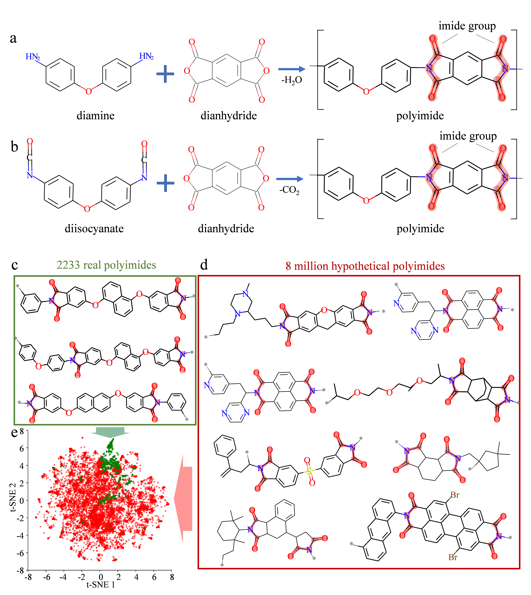

# Polyimide_explorer

A machine-learning implementation that evaluate the thermal and mechanical properties of the "golden plastic" polyimide. Based on it we develop an online interactive platform http://polyimide.herokuapp.com. It provides a visualization of more than 77,000 high-performing hypothetical polyimides. Their commercially available reacting components are linked in the platform to the PubChem database. The machine learning model is also embedded in the platform for an easy application. Please refer to our work "Discovery of Multi-Functional Polyimides through High-Throughput Screening using Explainable Machine Learning" for additional details.

https://user-images.githubusercontent.com/18473469/205360407-ca71a067-7693-4b6b-a0df-4651911c052c.mp4

 

 

## Datasets
The training set of real polyimides comes from the PolyInfo database https://polymer.nims.go.jp/en/ (National Institute for Materials Science (NIMS) holds the copyright of this database system).

For the discovery of novel high-performing polymimides, we build a comprehensive library of more than 8 million hypothetical polyimides based on the polycondensation of existing dianhydride and diamine/diisocyanate molecules.

 

## High-performing novel polyimides
In the design space of the three properties (σy, E, and Tg), 3 best-performing hypothetical polyimides (high σy, E, and Tg at the same time) are identified from the 8 million hypothetical polyimides. The discovered hypothetical polyimides are beyond the Pareto frontier boundary of real polyimides, suggesting superior performances. 

 

## License
Please refer to our paper for details.
